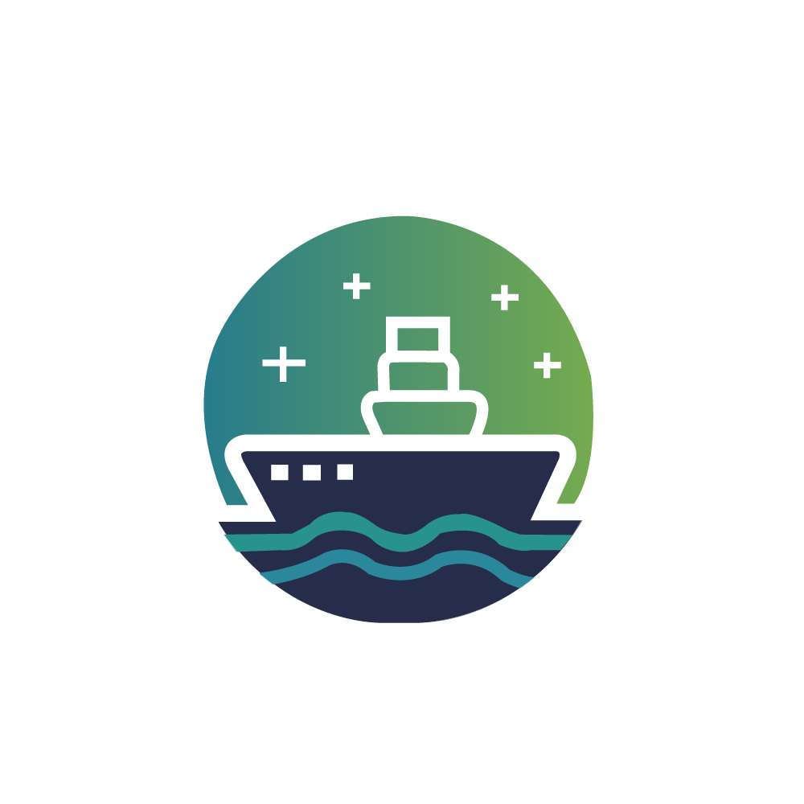
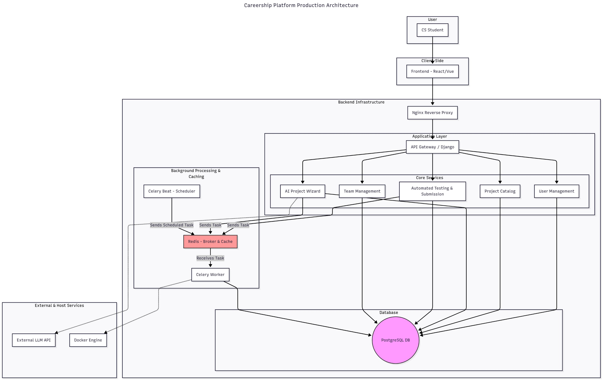

# Careership - Experiential Learning Platform for Developers 🚀

<div align="center" >

</div>

<p align="center">
  <strong>Bridging the gap between academic theory and real-world industry skills.</strong>
  <br />
  <a href="https://dev.d3uog1tvqvta9r.amplifyapp.com/"><strong>View Live Demo</strong></a>
  ·
  <a href="https://github.com/mostafa20220/CareerShip/issues">Report Bug</a>
  ·
  <a href="https://github.com/mostafa20220/CareerShip/issues">Request Feature</a>
</p>

<p align="center">
    
    
    
</p>

---

## 🎥 Demo Video

Watch a full walkthrough and demonstration of the platform's features:

[](https://www.youtube.com/watch?v=1b-bUHQZGhQ)

---

## 📌 About The Project

**Careership** is an interactive, RESTful API-driven educational platform designed to provide Computer Science students with crucial hands-on experience. The platform allows students to select real-world projects, build them following best practices, and receive instant, automated feedback on their code.

The core mission is to solve a common problem for students and junior developers: having a strong theoretical foundation but lacking a portfolio of practical, industry-standard projects. Careership provides a structured environment to build that portfolio, learn modern development workflows, and gain confidence before entering the job market.

---

## ✨ Key Features

* **🤖 Automated Testing Engine:** A robust system using **Docker** and **Celery** to securely run student code submissions against predefined test cases and provide immediate results.
* **🧠 AI-Powered Project Wizard:** Integration with the **Google Gemini Pro** model allows students to generate new, custom project specifications and receive contextual AI feedback on their code.
* **🤝 Team Management:** Students can form teams, send invitations, and collaborate on larger projects, simulating a real-world development environment.
* **📜 Certificate Generation:** Automatically issues verifiable PDF certificates to students who successfully complete projects, providing a tangible reward for their efforts.
* **🔐 Secure Authentication:** Features a hybrid authentication system with traditional token-based **JWT** and social login via **Google & GitHub OAuth 2.0**.
* **🚀 Cloud Deployment:** Fully deployed on **AWS**, leveraging EC2 for the backend, RDS for the database, and Amplify for frontend CI/CD.

---

## 🏗️ Architecture Diagram

The platform is built on a modern, scalable microservices-inspired architecture to ensure reliability and performance.

<p align="center">
</p>

---

## 🛠️ Tech Stack

This project leverages a wide range of modern technologies:

| Category      | Technology                                     |
| :------------ | :--------------------------------------------- |
| **Backend** | Django, Django REST Framework                  |
| **Frontend** | React, MUI, TailwindCSS                        |
| **Database** | PostgreSQL                                     |
| **Async/Cache** | Celery, Celery Beat, Redis                     |
| **Auth** | JWT (JSON Web Tokens), Google & GitHub OAuth 2.0 |
| **AI** | Google Gemini API                              |
| **DevOps** | Docker, Docker Compose, Nginx                  |
| **Deployment** | AWS (EC2, RDS, Amplify, S3)                    |

---

## 🚀 Getting Started

To get a local copy up and running, follow these simple steps.

### Prerequisites

* Docker and Docker Compose
* Python 3.9+
* Node.js and npm (for frontend)

### Installation

1.  **Clone the Repositories**
    * Create a main project directory and clone both repos inside it.
        ```sh
        mkdir CareershipProject
        cd CareershipProject
        git clone https://github.com/mostafa20220/CareerShip.git
        git clone https://github.com/mostafa20220/careership-frontend.git
        ```

2.  **Backend Setup**
    * Navigate to the backend directory: `cd CareerShip`
    * Create your environment file by copying the example. Then, open the new `.env` file and add your secret keys.
        ```sh
        cp .env.example .env
        ```
    * **Install Python Dependencies (Local Virtual Environment)**
        *(Note: The following steps are for a local setup. The recommended Docker setup handles this automatically.)*
        
        1. Create a virtual environment:
           ```sh
           python -m venv .venv
           ```
        2. Activate the virtual environment:
           * On Windows:
             ```sh
             .venv\Scripts\activate
             ```
           * On macOS/Linux:
             ```sh
             source .venv/bin/activate
             ```
        3. Install the required packages:
           ```sh
           pip install -r requirements.txt
           ```
    * **Run with Docker (Recommended)**
        * Build and run the Docker containers:
          ```sh
          docker-compose up --build -d
          ```
        * Run database migrations:
          ```sh
          docker-compose exec web python manage.py migrate
          ```

3.  **Frontend Setup**
    * Navigate to the frontend directory: `cd ../careership-frontend`
    * Create your local environment file by copying the example. Then, open the new `.env.local` file and add your API URL and client IDs.
        ```sh
        cp .env.example .env.local
        ```
    * Install NPM packages:
        ```sh
        npm install
        ```
    * Start the development server:
        ```sh
        npm start
        ```

The backend will be available at `http://localhost:8001` and the frontend at `http://localhost:5173`.

---

## 🤝 Contributing

Contributions are what make the open-source community such an amazing place to learn, inspire, and create. Any contributions you make are **greatly appreciated**.

If you have a suggestion that would make this better, please fork the repo and create a pull request. You can also simply open an issue with the tag "enhancement".

1.  Fork the Project
2.  Create your Feature Branch (`git checkout -b feature/AmazingFeature`)
3.  Commit your Changes (`git commit -m 'Add some AmazingFeature'`)
4.  Push to the Branch (`git push origin feature/AmazingFeature`)
5.  Open a Pull Request

---

## 📜 License

Distributed under the MIT License. See `LICENSE` for more information.

---

## 📬 Contact

Mostafa Hesham - [mostafa.hesham.cs.@gmail.com](mailto:mostafa.hesham.cs@gmail.com)
Omar Khaled - [omar.khaledmo152@gmail.com](mailto:omar.khaledmo152@gmail.com)

**Project Links:**
* **Backend:** [https://github.com/mostafa20220/CareerShip](https://github.com/mostafa20220/CareerShip)
* **Frontend:** [https://github.com/mostafa20220/CareerShip-frontend](https://github.com/mostafa20220/CareerShip-frontend)
